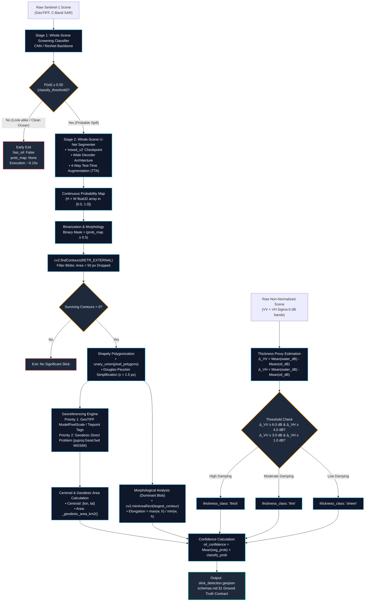
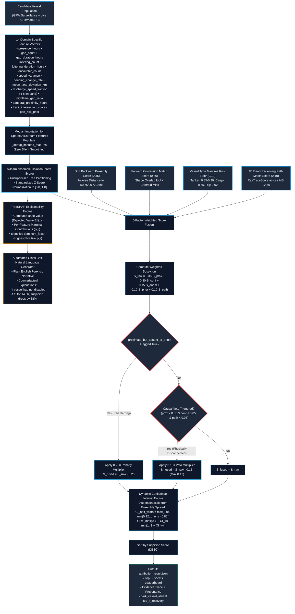
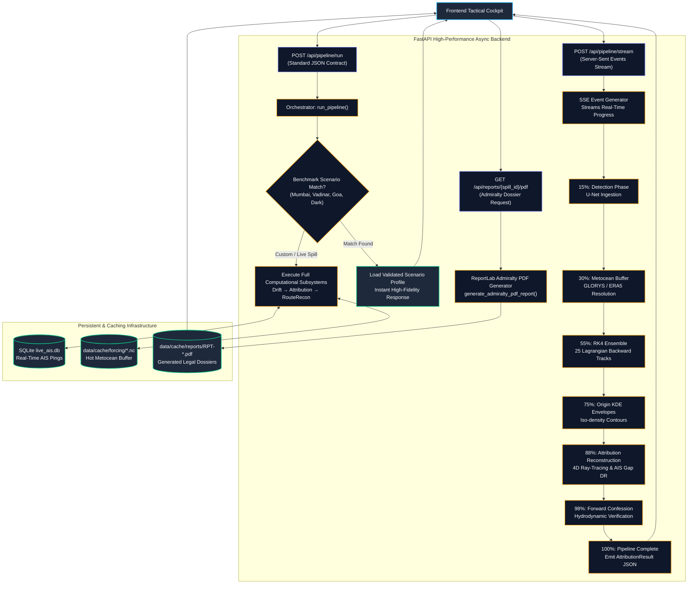
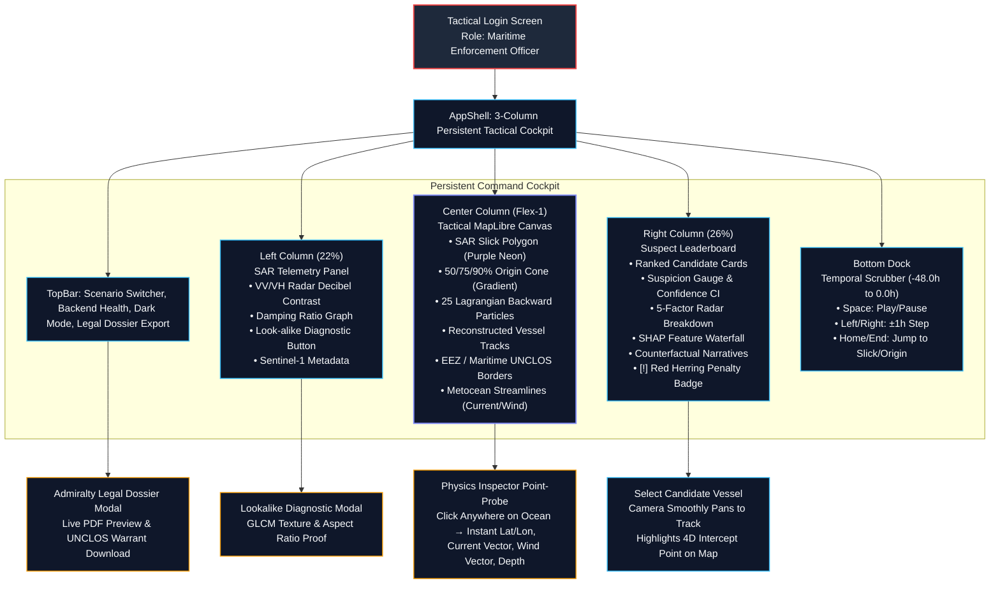

# OilTrace (SIH26143 — NTRO) Complete Architecture & Flowchart Suite

This document contains the complete technical flowchart suite for **OilTrace: Satellite SAR Oil Spill Detection, Lagrangian Metocean Drift Hindcasting, and AIS/Dark-Vessel Attribution**.

---

## 1. Master End-to-End Forensics Pipeline

```mermaid
flowchart TD
    classDef input fill:#1e293b,stroke:#0284c7,stroke-width:2px,color:#f8fafc;
    classDef sub1 fill:#0f172a,stroke:#38bdf8,stroke-width:2px,color:#f8fafc;
    classDef sub2 fill:#0f172a,stroke:#818cf8,stroke-width:2px,color:#f8fafc;
    classDef sub3 fill:#0f172a,stroke:#f59e0b,stroke-width:2px,color:#f8fafc;
    classDef fusion fill:#0f172a,stroke:#ef4444,stroke-width:2px,color:#f8fafc;
    classDef output fill:#1e293b,stroke:#10b981,stroke-width:2px,color:#f8fafc;

    S1["Sentinel-1 SAR Scene<br/>(C-Band Level-1 GRD GeoTIFF)"]:::input --> DETECT["Subsystem 1: SAR Cascade<br/>Stage 1 Classifier Gate + Stage 2 Whole-Scene U-Net"]:::sub1
    
    DETECT --> GEOJSON["Canonical slick_detection.geojson<br/>• Spill Centroid (lon, lat)<br/>• Area (km²), Elongation Ratio<br/>• Thickness Class (dB damping)"]:::sub1

    GEOJSON --> DRIFT["Subsystem 2: OpenDrift 1.14.10<br/>Hot Metocean Buffer (GLORYS + ERA5)<br/>25-Member RK4 Lagrangian Ensemble"]:::sub2

    DRIFT --> CONE["Canonical origin_ensemble.json<br/>• 50%, 75%, 90% KDE Probability Envelopes<br/>• Estimated Release Window (T_spill ± 6h)"]:::sub2

    CONE --> RECON["Subsystem 3: AIS Spatiotemporal Ingestion<br/>• Global Fishing Watch (GFW) API v2<br/>• Live AISstream WebSocket (live_ais.db)"]:::sub3

    RECON --> DR["4D Ocean-Current Dead Reckoning<br/>Euler Advection across AIS Blackout Gaps"]:::sub3

    DR --> CONF["Subsystem 4: Forward Confession Sim<br/>Reverse Hydrodynamic Testing on Top Suspects"]:::sub2

    CONF --> SCORER["Subsystem 5: 5-Factor Attribution Scorer<br/>• Proximity (0.35) • Confession (0.30)<br/>• Isolation Forest (0.15) • Prior (0.10) • Path Match (0.10)<br/>• SHAP Glass-Box XAI + Causal Veto Gate"]:::fusion

    SCORER --> ATTR_JSON["Canonical attribution_result.json<br/>• Ranked Candidate Suspects<br/>• Confidence Intervals [CI_lo, CI_hi]<br/>• Provenance (real_gfw | real_live | synthetic)"]:::fusion

    ATTR_JSON --> ORCH["FastAPI Backend Orchestrator<br/>Dual-Channel: REST /run & SSE /stream"]:::output

    ORCH --> UI["Frontend Tactical Cockpit (MapLibre GL)<br/>• 3-Column Persistent Forensic Console<br/>• -48h to 0h Temporal Scrubber<br/>• Point-Probe Physics Inspector"]:::output
    ORCH --> PDF["Admiralty Legal Dossier (ReportLab PDF)<br/>• UNCLOS Art. 211(5) Directive<br/>• SHA-256 Chain-of-Custody Digital Seal"]:::output
```

---

## 2. Subsystem 1: Two-Stage SAR Detection & Physical Feature Extraction

---

## 3. Subsystem 2: Metocean Forcing Ingestion, Hot Buffer & Lagrangian Backward Ensemble

```mermaid
flowchart TD
    classDef input fill:#1e293b,stroke:#0284c7,stroke-width:2px,color:#f8fafc;
    classDef proc fill:#0f172a,stroke:#818cf8,stroke-width:1.5px,color:#f8fafc;
    classDef dec fill:#1e293b,stroke:#f59e0b,stroke-width:2px,color:#f8fafc;
    classDef loop fill:#0f172a,stroke:#38bdf8,stroke-width:2px,color:#f8fafc;
    classDef pass fill:#1e293b,stroke:#10b981,stroke-width:2px,color:#f8fafc;

    REQ["Pipeline Request:<br/>Centroid (lon, lat), detected_at, backward_hours=48"]:::input --> BBOX["Bounding Box & Temporal Window Calculation<br/>• Bbox: [lon ± 3.0°, lat ± 3.0°]<br/>• Time: (detected_at - 54h) to (detected_at + 6h)"]:::proc

    BBOX --> BUF{"Hot Metocean Buffer<br/>Available on Disk?"}:::dec
    
    BUF -- "No / Out-of-Bounds" --> REMOTE["Remote Acquisition Pipeline<br/>• CMEMS API: GLORYS12V1 Daily Surface Currents (uo, vo)<br/>• CDS API: ECMWF ERA5 10m Hourly Winds (u10, v10)<br/>• INCOIS Indian Ocean Regional Client (Fallback)"]:::proc
    
    BUF -- "Yes" --> CACHE["Load NetCDF CF Generic Files<br/>data/cache/forcing/*.nc"]:::proc
    REMOTE --> CACHE

    CACHE --> ENS_INIT["Initialize Monte Carlo Ensemble Engine<br/>N = 25 Independent Members, Δt = -900s (-15 min)"]:::proc

    ENS_INIT --> LOOP["For Each Ensemble Member (i = 1 to 25)"]:::loop

    LOOP --> PERTURB["Apply Physical Perturbations:<br/>1. Seed Radius: r ~ U(0.6, 1.4) × 500m<br/>2. Wind Drift Leeway: α ~ N(0.030, 0.004) (3% ± 0.4%)<br/>3. Turbulent Diffusivity: Kh = 10.0 m²/s (Random Walk)<br/>4. Current Uncertainty: GLORYS vector ± 15%"]:::proc

    PERTURB --> RK4["Runge-Kutta 4th-Order (RK4) Backward Integration<br/>dX/dt = - [U_current(X, t) + α · W_wind(X, t) + R_diff(Kh)]<br/>Total Steps: 193 steps (-48 hours)"]:::proc

    RK4 --> CHECK{"Member Reached Full Duration?<br/>(No Truncation / Boundary Exit)"}:::dec
    
    CHECK -- "No (Truncated / Left Domain)" --> DROP["Drop Member (Loud Diagnostic Warning)<br/>Prevent Origin Corruption"]:::proc
    CHECK -- "Yes (Full 48h)" --> KEEP["Keep Endpoint (lon, lat, -48h)<br/>Subsample Trajectory for Replay (8 particles)"]:::proc

    DROP & KEEP --> ALL_DONE{"All 25 Members Processed?"}:::dec
    ALL_DONE -- "No" --> LOOP

    ALL_DONE -- "Yes" --> VAL{"n_complete > 0?"}:::dec
    VAL -- "No (Zero Valid Endpoints)" --> FAIL["Raise RuntimeError: Window Too Narrow"]:::proc

    VAL -- "Yes" --> KDE["2D Gaussian Kernel Density Estimation (KDE)<br/>scipy.stats.gaussian_kde(lons, lats)<br/>Grid Resolution: 100 × 100 on Matplotlib Contour Engine"]:::proc

    KDE --> CONTOUR["Extract Iso-Probability Contours<br/>• Level 50%: Core Origin Envelope (P=0.50)<br/>• Level 75%: Confidence Envelope (P=0.75)<br/>• Level 90%: Maximum Dispersion Boundary (P=0.90)"]:::proc

    CONTOUR --> CLEAN_GEO["Shapely make_valid() & Polygon Simplification<br/>Ensure Clean Closed Polygons"]:::proc

    CLEAN_GEO --> AGE["Empirical Spill Age Heuristic<br/>Fay Spreading Law Inversion: t_age = (Area_km² / 1.5)^0.6<br/>Adjusted by Elongation Ratio"]:::proc

    AGE --> OUT["Output: origin_ensemble.json<br/>schemas.md §2 Ground Truth Contract"]:::pass
```

---

## 4. Subsystem 3: 4D Dead-Reckoning Route Reconstruction & Dark Vessel Identification

```mermaid
flowchart TD
    classDef input fill:#1e293b,stroke:#0284c7,stroke-width:2px,color:#f8fafc;
    classDef proc fill:#0f172a,stroke:#f59e0b,stroke-width:1.5px,color:#f8fafc;
    classDef dec fill:#1e293b,stroke:#38bdf8,stroke-width:2px,color:#f8fafc;
    classDef alert fill:#1e293b,stroke:#ef4444,stroke-width:2px,color:#f8fafc;
    classDef pass fill:#1e293b,stroke:#10b981,stroke-width:2px,color:#f8fafc;

    INPUT["Input: Candidate Vessel AIS Fixes<br/>+ Origin Probability Cone (origin_ensemble.json)<br/>+ Estimated Spill Window (T_spill ± 6h)"]:::input --> SORT["Sort Waypoints Chronologically (timestamp ASC)"]:::proc

    SORT --> SCAN["Iterate Consecutive Waypoints (P_k, P_{k+1})<br/>Compute Δt = t_{k+1} - t_k"]:::proc

    SCAN --> GAP{"Δt > 1.5 hours?<br/>(AIS Transponder Blackout)"}:::dec

    GAP -- "No (Continuous AIS)" --> KEEP_WP["Retain Verified AIS Fixes<br/>is_interpolated = False"]:::proc

    GAP -- "Yes (Dark Vessel Gap)" --> DR_INIT["Initialize Current-Assisted Dead Reckoning<br/>Step Size: Δt_step = 15 minutes"]:::proc

    DR_INIT --> DR_LOOP["Euler Advection across Gap:<br/>x_{t+Δt} = x_t + [V_vessel(SOG, COG) + U_GLORYS(x_t, t)] · Δt<br/>Generate Dead-Reckoned Waypoints<br/>is_interpolated = True"]:::proc

    KEEP_WP & DR_LOOP --> FULL_TRACK["Assembled Full 4D Reconstructed Track<br/>Polyline W = { (lon_i, lat_i, t_i, sog_i, cog_i) }"]:::proc

    FULL_TRACK --> RAYTRACE["4D Spatiotemporal Ray-Tracing against Origin Cone<br/>For each waypoint w_i in W:<br/>1. Evaluate Spatial Containment in Cone Polygons<br/>   ConeWeight = 1.0 (50%), 0.75 (75%), 0.50 (90%)<br/>2. Apply Exponential Temporal Decay:<br/>   T_decay = exp(- |t_i - T_origin| / τ) where τ = 6.0h"]:::proc

    RAYTRACE --> SCORE["Ray-Trace Score Calculation:<br/>RayTraceScore = max_i [ ConeWeight(w_i) · exp(-|t_i - T_origin| / 6.0) ]"]:::proc

    SCORE --> CPA["Compute Closest Point of Approach (CPA)<br/>• cpa_distance_km = min Haversine(w_i, Cone Centroid)<br/>• cpa_time_diff_hours = |t_CPA - T_origin|"]:::proc

    CPA --> RED_HERRING{"Current Distance < 15 km<br/>AND<br/>path_match_score < 0.20?"}:::dec

    RED_HERRING -- "Yes" --> FLAG_RH["Flag: [!] PROXIMATE NOW // ABSENT AT ORIGIN<br/>proximate_but_absent_at_origin = True<br/>Apply 0.25× Suspicion Penalty Factor"]:::alert

    RED_HERRING -- "No" --> CHECK_VETO{"cpa_time_diff > 12h<br/>OR<br/>(prox < 0.05 & conf < 0.05 & path < 0.05)?"}:::dec

    CHECK_VETO -- "Yes" --> APPLY_VETO["Trigger Causal Veto Gate<br/>causal_veto = True<br/>Force Suspicion Score ≤ 0.12 (Disconnected Vessel)"]:::alert

    CHECK_VETO -- "No" --> PASS["Valid Spatiotemporal Intercept<br/>path_match_score = round(RayTraceScore, 4)"]:::pass

    FLAG_RH & APPLY_VETO & PASS --> ATTR_INPUT["Transmit to 5-Factor Scorer & Tactical Cockpit"]:::proc
```

---

## 5. Subsystem 4: Hydrodynamic Forward Confession Simulation

```mermaid
flowchart TD
    classDef input fill:#1e293b,stroke:#0284c7,stroke-width:2px,color:#f8fafc;
    classDef proc fill:#0f172a,stroke:#818cf8,stroke-width:1.5px,color:#f8fafc;
    classDef dec fill:#1e293b,stroke:#f59e0b,stroke-width:2px,color:#f8fafc;
    classDef pass fill:#1e293b,stroke:#10b981,stroke-width:2px,color:#f8fafc;

    IN["Top Candidate Vessels (Ranked 1 to 4)<br/>• Vessel Trajectory Waypoints<br/>• Estimated Release Time T_spill"]:::input --> LOC["Extract Candidate Coordinate at T_spill<br/>(rel_lon, rel_lat)"]:::proc

    LOC --> RELEASE["Seed Forward Oil Particles<br/>N = 100 Particles per Candidate<br/>Release Time: T_spill"]:::proc

    RELEASE --> FORWARD["Execute Forward Lagrangian Advection<br/>(Fast RK4 Engine or OpenOil Forward)<br/>Time Direction: POSITIVE (T_spill → T_SAR)"]:::proc

    FORWARD --> FORCING["Drive with Same Metocean Forcing Fields:<br/>• CMEMS GLORYS Current Vectors (uo, vo)<br/>• ECMWF ERA5 Wind Vectors (u10, v10)"]:::proc

    FORCING --> ARRIVE["Forward Simulation Arrives at T_SAR<br/>Particle Positions: { (lon_j, lat_j) }"]:::proc

    ARRIVE --> HULL["Construct Particle Cluster Geometry<br/>Alpha Shape / Convex Hull in Shapely"]:::proc

    HULL --> OVERLAP["Spatial Intersection Analysis with Observed SAR Polygon:<br/>1. Centroid Miss Distance: d_miss = Haversine(Hull_centroid, SAR_centroid)<br/>2. Distance Score: S_dist = exp(- d_miss / 15.0 km)<br/>3. Shape IoU Overlap: IoU = Area(Hull ∩ SAR) / Area(Hull ∪ SAR)"]:::proc

    OVERLAP --> FUSED_CONF["Confession Match Score Formulation:<br/>shape_overlap_score = 0.65 · S_dist + 0.35 · IoU"]:::proc

    FUSED_CONF --> HYP["Record Forward Hypothesis Entry:<br/>{<br/>  vessel_id: MMSI,<br/>  shape_overlap_score: float,<br/>  predicted_centroid: [lon, lat],<br/>  drift_error_km: d_miss<br/>}"]:::proc

    HYP --> FEED["Feed into 5-Factor Attribution Scorer<br/>Weight: 0.30 of Total Suspicion Score"]:::pass
```

---

## 6. Subsystem 5: 5-Factor Explainable AI (XAI) Attribution Scorer

---

## 7. Backend Architecture & Dual-Mode Orchestration (REST + SSE)

---

## 8. Frontend Tactical Cockpit & Operational User Workflow

